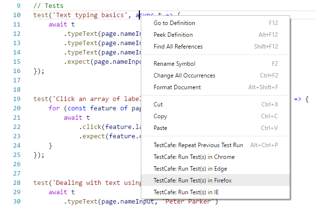
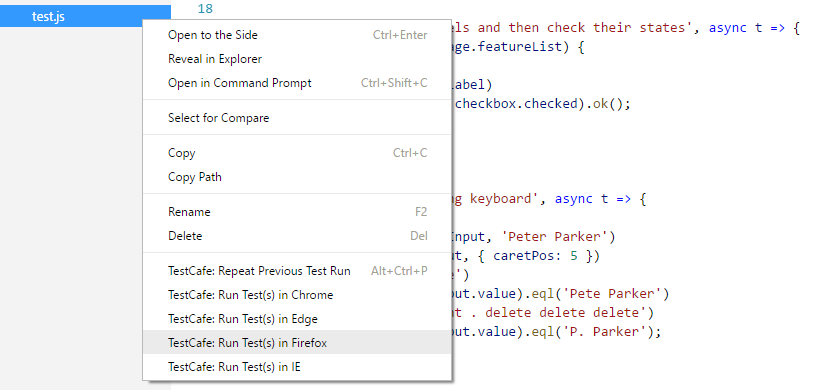
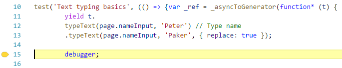
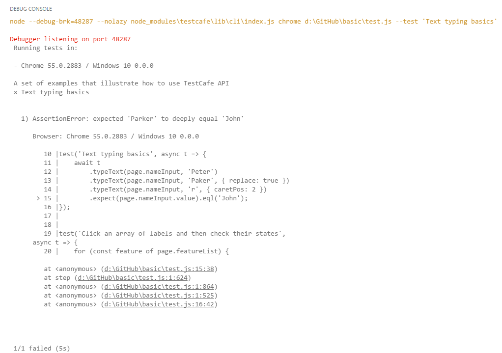

# TestCafe Test Runner for Visual Studio Code

[TestCafe](https://devexpress.github.io/testcafe/) is a pure Node.js end-to-end framework for testing web apps. This extension allows you to run TestCafe tests directly from VS Code.

* Run a particular test, fixture, all tests in a file or directory via the context menu or built-in commands
* Automatically detect browsers installed on the local machine
* Repeat last test run
* Debug tests
* View test results in the `Debug Console` panel


## Requirements

[TestCafe](https://github.com/DevExpress/testcafe) should be installed in your project as a local package. To install it, use the `npm install testcafe` command.
For Mac OS, add `TestCafe` to dependencies in your `package.json` file. Your project should contain TestCafe modules in `node_modules\testcafe\...`.

## How to install extension

Install the **TestCafe Test Runner** extension from VS Code Marketplace as described in the VS Code [documentation](https://code.visualstudio.com/Docs/editor/extension-gallery).

## Features

### Activation

While activating, the extension detects browsers installed on your machine. For each browser, the extension creates a corresponding command and an item in the context menu.



### Running a particular test

To run a particular test, invoke the context menu when the cursor is placed within the test body and select `TestCafe: Run Test(s) in...` for the required browser.

### Running a particular test fixture

To run all tests in a particular test fixture, invoke the context menu when the cursor is placed within this fixture outside of a test body and select `TestCafe: Run Test(s) in...` for the required browser.

### Running all tests in a file

To run all tests in the current file, invoke the context menu for this file in the Explorer panel and select `TestCafe: Run Test(s) in...` for the required browser.



### Running all tests in a folder

To run all test files in a folder, invoke the context menu for this folder in the Explorer panel and select `TestCafe: Run Test(s) in...` for the required browser.

### Rerunning previous tests

If you need to run the same set of tests you ran previously, invoke the context menu and select `Repeat Previous Test Run`. Alternatively, you can use the `Ctrl+Alt+P` shortcut.
This command is available after the first test run.

### Test Debugging

To debug your test, place the `debugger` statement in test code and run this test via one of the commands. Test execution will be stopped once it reaches the `debugger` statement and you will be able to continue step-by-step.



### Test Result 

You can view a test run report in the `Debug console`.




### Update browser list

When you install a new browser or delete an existing one, update the extension's browser list. To do this, use the `TestCafe: Refresh Browser List` command or the `Ctrl+Alt+U` shortcut.

## Commands and shortcuts

To run built-in commands, press `Ctrl+Shift+P` and type the command name:

* *TestCafe: Run Test(s) in IE, TestCafe: Run Test(s) in Chrome,  ...* - runs a test or fixture at the cursor position in the specified browser.
* *TestCafe: Repeat Previous Test Run* (`Ctrl+Alt+P`) - reruns a set of tests that was run previously.
* *TestCafe: Refresh Browser List* (`Ctrl+Alt+U`) - refreshes the list of installed browsers.

## Configuration

* *testcafeTestRunner.customArguments* - Specifies the custom arguments of the TestCafe Command Line Interface. See the whole list of available arguments in the [TestCafe documentation](https://devexpress.github.io/testcafe/documentation/using-testcafe/command-line-interface.html#options). The arguments should be separated by space.
    * The value of this configuration property will be joined to the standard arguments list generated by this extension.
    * Example:
```
{
    "testcafeTestRunner.customArguments": "--speed 0.1"
}
```
* *testcafeTestRunner.workspaceRoot* - Specifies a relative path to append to the workspace root when searching for the testcafe library. This path should contain a node_modules directory with testcafe installed; defaults to the project root. This setting is useful if you keep your testcafe files in a nested node_modules folder.
    * Example:
```
{
    "testcafeTestRunner.workspaceRoot": "/acceptance"
}
```


## Sources

* [TestCafe Test Runner](https://github.com/romanresh/vscode-testcafe)
* [TestCafe](https://github.com/DevExpress/testcafe)