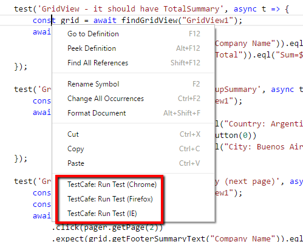

# TestCafe Runner for Visual Studio Code
Allows to run TestCafe tests directly from VS Code via context menu or built-in commands. Test results will be shown in the `Debug Console` panel. The tests are running in the Debug mode, so the breakpoints will work as expected.

Built-in commands:
* TestCafe: Run Test (Chrome)
* TestCafe: Run Test (IE)
* TestCafe: Run Test (Firefox)
* TestCafe: Repeat Previous Test Run

Current Limitations
-----

1. TestCafe should be installed as a local package
2. VS Code Project folder should contain the `node_modules` folder with TestCafe
3. Only .js test files are supported

Sources
-----
[GitHub](https://github.com/romanresh/vscode-testcafe)